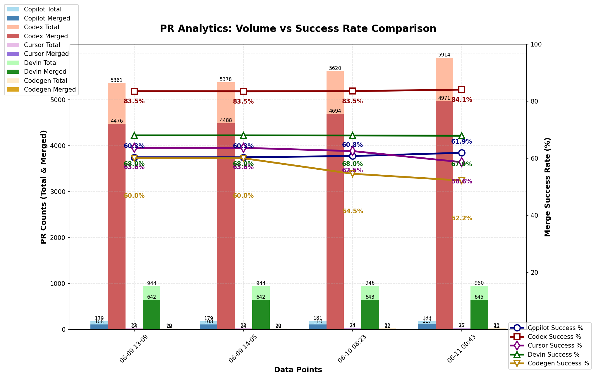

### PR Analytics: Volume vs Success Rate (auto‑updated)

View the [interactive dashboard](https://hovancik.net/ai-pr-watcher-rust/) for these statistics.

Forked from [https://github.com/aavetis/ai-pr-watcher](https://github.com/aavetis/ai-pr-watcher).

## Data sources

Explore the GitHub search queries used:

- **All Copilot PRs**: [language:rust is:pr head:copilot/](https://github.com/search?q=language:Rust+is:pr+head:copilot/&type=pullrequests)
- **Merged Copilot PRs**: [language:rust is:pr head:copilot/ is:merged](https://github.com/search?q=language:Rust+is:pr+head:copilot/+is:merged&type=pullrequests)
- **All Codex PRs**: [language:rust is:pr head:codex/](https://github.com/search?q=language:Rust+is:pr+head:codex/&type=pullrequests)
- **Merged Codex PRs**: [language:rust is:pr head:codex/ is:merged](https://github.com/search?q=language:Rust+is:pr+head:codex/+is:merged&type=pullrequests)
- **All Cursor PRs**: [language:rust is:pr head:cursor/](https://github.com/search?q=language:Rust+is:pr+head:cursor/&type=pullrequests)
- **Merged Cursor PRs**: [language:rust is:pr head:cursor/ is:merged](https://github.com/search?q=language:Rust+is:pr+head:cursor/+is:merged&type=pullrequests)
- **All Devin PRs**: [language:rust author:devin-ai-integration[bot]](https://github.com/search?q=language:Rust+author:devin-ai-integration[bot]&type=pullrequests)
- **Merged Devin PRs**: [language:rust author:devin-ai-integration[bot] is:merged](https://github.com/search?q=language:Rust+author:devin-ai-integration[bot]+is:merged&type=pullrequests)
- **All Codegen PRs**: [language:rust author:codegen-sh[bot]](https://github.com/search?q=language:Rust+author:codegen-sh[bot]&type=pullrequests)
- **Merged Codegen PRs**: [language:rust author:codegen-sh[bot] is:merged](https://github.com/search?q=language:Rust+author:codegen-sh[bot]+is:merged&type=pullrequests)

---

## Current Statistics

| Project | Total PRs | Merged PRs | Merge Rate |
| ------- | --------- | ---------- | ---------- |
| Copilot | 234 | 144 | 61.54% |
| Codex   | 6,767 | 5,746 | 84.91% |
| Cursor  | 40 | 26 | 65.00% |
| Devin   | 957 | 646 | 67.50% |
| Codegen | 23 | 12 | 52.17% |